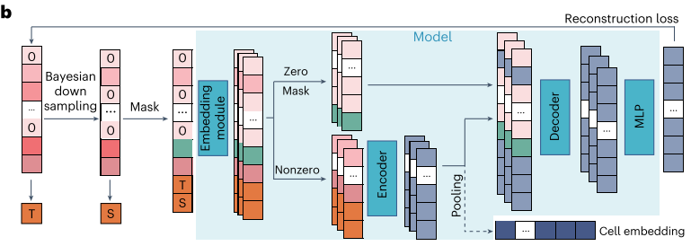

| 标题 | Large-scale Foundation Model on Single-cell Transcriptomics  |
| :--: | ------------------------------------------------------------ |
| 作者 | Minsheng Hao;Jing Gong;Xin Zeng;Chiming Liu;Yucheng Guo;Xingyi Cheng;Taifeng Wang;Jianzhu Ma;Xuegong Zhang;Le Song |
| 机构 | Tsinghua University;Bio Map                                  |
| 邮箱 | pmajianzhu@tsinghua.edu.cn;                                  |
| 论文 | https://www.nature.com/articles/s41592-024-02305-7           |

## 摘要

​		大型预训练模型已成为自然语言处理及相关领域的基础模型，取得突破性进展。开发破译细胞“语言”和促进生物医学研究的基础模型有良好的前景，但也具有挑战性。在这里，我们开发了一个大型的预训练模型SCFoundation，也被命名为‘xTrimoscFoundationα’，具有1亿个参数，覆盖大约20,000个基因，对5000多万个人类单细胞转录图谱进行预训练。从可训练参数的大小、基因的维度和训练数据量来看，SCFoundation是一个大规模的模型。它的非对称transformer结构和预训练任务设计使其能够有效地捕获各种细胞类型和状态下基因之间的复杂上下文关系。实验表明，它作为基础模型在各种单细胞分析任务中实现了最先进的性能，如基因表达增强、组织药物反应预测、单细胞药物反应分类、单细胞扰动预测、细胞类型注释和基因模块推断。

## 介绍

​	在生命科学中，生物体有其潜在的“语言”。 细胞是人体的基本结构和功能单位，由DNA、RNA、蛋白质、基因表达值等无数“单词”组成“句子”。 一个有趣的问题是：我们能否开发基于大量细胞“句子”的细胞基础模型？

​	单细胞转录组学为开发基础模型提供所有类型细胞的转录组句子的大量档案。 由于数百万个细胞中约有 20,000 个蛋白质编码基因，观察到的基因表达值可达到万亿“token”的量级，这与用于训练大型语言模型（LLM）的自然语言文本量相当。 这为我们预训练大规模模型提供了基础，以提取复杂的、多方面的细胞内部模式，类似于大语言模型从大量自然语言文本档案中学习人类知识。

​	在LLM预训练中，模型和数据规模的增长对于构建能够有效挖掘错综复杂的多层次内部关系的基础模型至关重要。 最近，单细胞数据的预训练模型取得了进展，但创建大规模基础模型仍然面临着独特的挑战。 **首先，基因表达预训练数据需要涵盖不同状态和类型的细胞景观。** 目前，大多数scRNA-seq数据组织松散，仍然缺乏全面完整的数据库。 **其次，当将每个细胞建模为一个句子，将每个基因表达值建模为一个单词时，近 20,000 个蛋白质编码基因使“句子”异常长，这是传统 Transformer 难以处理的情况**。 现有的工作常常不得不将他们的模型限制在一小部分选定的基因上。 **第三，不同技术和实验室的 scRNA-seq 数据在测序读取深度方面表现出很大差异。** 与由于技术影响（例如通过对大量数据进行训练可以减少污染）产生的随机噪声不同，读取深度不是随机的，其变化阻碍了模型学习统一且有意义的细胞和基因表示。

​	在本文中，我们解决了这些挑战，并设计了一个大型基础模型 scFoundation，包含 1 亿个参数，作用于约 20,000 个基因。 我们收集了包含超过 5000 万个基因表达谱的 scRNA-seq 数据集用于预训练。 我们为 scRNA-seq 数据开发了一种非对称架构，以加速训练过程并提高模型可扩展性。 我们设计了一个读取深度感知（RDA）建模预训练任务，使 scFoundation 不仅能够对细胞内的基因共表达模式进行建模，而且还能将具有不同读取深度的细胞联系起来。

​	为了验证 scFoundation 的能力，我们对多个下游任务进行了实验，包括细胞聚类、批量数据的药物反应预测、单细胞药物反应分类、单细胞扰动预测和细胞类型注释。 认识到用户微调大型模型的计算负担，我们通过将非微调或轻度微调的 scFoundation 上下文嵌入应用于相应的下游模型来实现先进的性能。 我们还展示了使用 scFoundation 的基因嵌入来推断基因模块和基因调控网络。 所有结果都证明了 scFoundation 在转录组学数据分析方面的力量和价值，以及作为促进生物学和医学任务学习的基础功能。 这项工作探索并突破了单细胞领域基础模型的界限。

## 结果

### scFoundation预训练框架

​	我们开发了 scFoundation，用于对 19,264 个基因进行建模，其中约 1 亿个参数在超过 5000 万个 scRNA-seq 数据上进行了预训练。 这是单细胞领域大参数量、基因覆盖度和数据规模的大型模型。 我们的预训练框架中的三个关键部分增强了有效训练此类模型的能力：**模型设计**、**预训练任务**和**数据收集**。 

​	我们开发了 xTrimoGene，这是一种基于 Transformer 的可扩展模型，具有算法效率和工程加速的策略。 它包括一个embedding模块和一个非对称encoder-decoder结构。 embedding模块将连续的基因表达标量转换为可学习的高维向量，确保完全保留原始表达值，这比以前模型中使用的离散值有显着改进。 非对称encoder-decoder架构与计算机视觉中的 masked autoencoder模型类似，但旨在适应 scRNA-seq 数据的高度稀疏性，无需任何选择即可实现所有基因关系的高效学习。 此外，我们在模型部署中融入了多种大规模模型训练优化技术，以确保高效训练。

​	通过考虑大规模数据中读取深度的高方差，我们设计了一个称为 RDA 建模的预训练任务，它是屏蔽语言建模的扩展。 在 RDA 建模中，模型根据细胞的背景基因预测细胞的隐藏基因表达。 上下文来自该细胞基因表达谱的重复或低深度读数变体（方法）。 我们将总计数视为一个细胞的读取深度，并定义了两个总计数指标：T（“目标”）和 S（“源”），分别表示原始样本和输入样本的总计数。 我们随机屏蔽输入样本中的零表达基因和非零表达基因并记录它们的索引。 然后模型采用屏蔽输入样本和两个指标来预测原始样本在屏蔽索引处的表达值。

​                      		 

这使得预训练模型不仅能够捕获细胞内的基因-基因关系，而且能够协调具有不同读取深度的细胞。 当用于推理时，我们将细胞的原始基因表达输入预训练模型，并将 T 设置为高于其总计数 S，以生成具有增强读取深度的基因表达值。 我们进行了多次消融实验，以细胞聚类性能作为评估，以展示我们的模型架构和预训练任务设计的优势。

​	预训练后，我们将 scFoundation 模型应用于多个下游任务。scFoundation 编码器的输出被汇集到细胞级嵌入中，用于细胞级任务，包括聚类（数据集内和数据集间)、bulk和单细胞级药物反应预测和细胞类型注释。 scFoundation 解码器的输出是基因级上下文嵌入，常用于基因级任务，例如扰动预测和基因模块推理。 

### 无需微调、可扩展的读取深度增强模型

​	在我们的研究中，我们发现随着模型规模和计算量的增加，验证损失呈现幂律下降，这被称为大语言模型（LLMs）的“缩放定律”。我们训练了三个模型，参数规模分别为300万、1000万和1亿，并记录了它们在验证数据集上的损失。结果表明，随着模型参数和浮点运算数（FLOPs）的增加，验证损失呈现幂律下降。我们还评估了不同规模的xTrimoGene架构模型，并将其与之前的transformer模型和scVI进行了比较，发现1亿参数的scFoundation模型表现最佳。

​	我们评估了scFoundation通过设置更高的总计数T来增强输入细胞读取深度的能力。这一能力在从验证数据集中随机抽取的1万个细胞上进行了测试，数据被下采样至原始量的1%、5%、10%和20%。结果显示，即使在低下采样率下，scFoundation显著减少了平均绝对误差（MAE）和平均相对误差（MRE）。

​							 

​	在与其他插补方法（MAGIC、SAVER、scImpute和scVI）对比的实验中，scFoundation在一个人类胰岛细胞数据集上的聚类准确性指标（NMI、ARI、SIL）上表现出色。当读取深度设置为原始计数的倍数时，其性能在3.5倍时达到平台期。可视化结果证实了scFoundation在聚类方面的优势。

​	我们将scFoundation应用于Zheng68K数据集，该数据集包含大约6万个人的外周血单个核细胞，结果表明scFoundation在区分细胞类型方面表现出色，且在轮廓系数（SIL）上优于scVI。最后，scFoundation在与BBKNN结合用于跨批次细胞映射时表现出色，显示了其在无需特定数据集微调情况下增强读取深度的能力。

### 改善癌症药物反应预测

​	癌症药物反应（CDRs）研究肿瘤细胞对药物干预的反应。计算预测CDR对于指导抗癌药物设计和理解癌症生物学至关重要。我们将scFoundation与CDR预测方法DeepCDR结合起来，预测多个细胞系数据中的药物半数抑制浓度(IC~50~)值。这一实验验证了scFoundation是否能够为整体水平的基因表达数据提供有用的嵌入，即使它是在单细胞上训练的。

​	原始的DeepCDR模型使用药物结构信息和多组学数据作为输入，输出预测的IC~50~值。这里我们专注于基因表达数据，并用scFoundation替换了DeepCDR中的转录组多层感知器（MLP）子网络。我们使用了癌症细胞系百科全书和癌症药物敏感性基因组数据集来获取输入的细胞系基因表达数据、输入药物和IC~50~标签。

​	我们评估了基于scFoundation的结果与基于基因表达的结果在多个药物和癌症细胞系上的表现。使用scFoundation嵌入，大多数药物和所有癌症类型都实现了更高的PCC。我们可视化了药物和癌症类型的最佳预测案例。无论IC~50~高低，基于scFoundation的DeepCDR模型都能准确预测值，PCC超过0.93。在不包含某一药物的情况下，基于scFoundation的模型一致优于原始模型。

​	我们将药物分组为不同的治疗类型，以检查IC~50~预测性能是否与其内在机制有关。基于scFoundation预测的结果显示，化疗药物如抗肿瘤抗生素和拓扑异构酶抑制剂的PCC往往高于靶向治疗药物如ATM和PARP抑制剂。这可能是因为特定基因突变对靶向治疗有重要影响，但这种信息难以在基因表达数据中揭示，而化疗药物普遍与基因表达相关，因此它们的IC~50~更容易预测。基因表达结果总体上PCC较低，且在治疗类型之间未观察到性能差异。

​	我们使用模型预测数据中的未知CDR。为了验证这些预测，我们对新预测的相对低IC~50~进行了基因集合富集分析（GSEA），这表明细胞系对药物敏感。例如，在对柔红霉素敏感的细胞系中，鞘脂信号通路被富集。根据KEGG数据库，这条通路与鞘磷脂及其代谢有关。鞘磷脂被报道通过改变细胞膜通透性与柔红霉素协同作用，导致这些细胞系中药物的IC~50~降低。在对伏诺拉生敏感的细胞系中，mTOR信号通路被富集。先前的研究表明，伏诺拉生通过抑制mTOR信号通路抑制癌症生长。其他临床研究也表明mTOR抑制剂常与伏诺拉生联合使用，表明伏诺拉生与mTOR通路之间的关系。这些例子支持了我们预测的有效性。

​	尽管scFoundation在单细胞转录组学数据上预训练，但其学习的基因关系可以转移到整体水平的表达数据中，产生简洁的嵌入，从而促进更准确的IC~50~预测。

### 转移批量药物反应到单细胞中

​	推断单细胞水平的药物敏感性可以帮助识别具有不同药物耐药特性的特定细胞亚型，从而提供对潜在机制和新疗法的重要见解。我们将scFoundation应用于基于SCAD模型的单细胞水平药物反应分类任务。由于单细胞药物反应数据有限，SCAD使用领域适应方法消除单细胞和整体数据的差异，将在整体数据上学到的知识转移到单细胞药物敏感性推断中。这个过程将整体和单细胞数据作为输入，输出每个细胞的预测敏感性。在我们的设置中，我们使用未微调的scFoundation获取整体和单细胞数据的统一嵌入，并用这些嵌入训练SCAD模型。

​	我们重点研究了在原始研究中表现较差的四种药物（索拉非尼、NVP-TAE684、PLX4720和依托泊苷）。这些药物在癌症药物敏感性基因组数据库中有整体数据的药物敏感性标签，单细胞级别的真实药物敏感性标签通过不同方法获得。对于受PLX4720和依托泊苷影响的单细胞，未处理的细胞系中的细胞被视为敏感，而药物暴露后存活的细胞被视为耐药。对于受索拉非尼和NVP-TAE684影响的细胞，其敏感性标签通过被证实与药物反应相关的衰老相关（EpiSen）程序评分确定。

​	我们将基于scFoundation的模型与以所有基因表达值为输入的基线SCAD模型进行了比较。基于scFoundation的模型在所有药物上都获得了更高的AUC值，特别是在NVP-TAE684和索拉非尼上AUC提高超过0.2。基线结果中，四种药物的AUC最高为0.66，有一个结果甚至低于随机，显示出任务的难度。我们使用Spearman相关性评估预测的药物敏感性与EpiSen评分之间的关系。对于NVP-TAE684和索拉非尼，分别应与EpiSen评分正相关和负相关。scFoundation模型对这些药物显示出0.56和-0.55的Spearman相关性，而基线模型仅为0.24和-0.06，表明使用scFoundation嵌入能够捕捉药物敏感性生物标志物的信号。

​	这些结果促使我们进一步研究嵌入是否比基因表达更具信息性。我们对单细胞数据集SSC47的嵌入进行了主成分分析（PCA），并可视化了前两个主成分。结果显示，与原始数据PCA相比，嵌入捕捉到的丰富信息表现出较少的线性相关性。此外，我们基于嵌入和基因表达计算了整体和单细胞数据的聚类性能，使用药物敏感性作为标签。更高的Calinski-Harabasz（CH）和轮廓系数（SIL）分数表明，scFoundation在将具有相同药物反应的细胞或整体细胞系分组方面优于基线基因表达。

​	这些发现突出了scFoundation获得的统一嵌入将整体和单细胞数据对齐到一个统一的表示空间。这种简洁的表示在敏感和耐药状态的数据之间产生了明确的区分，促进了下游模型更好地将药物基因组信息从整体细胞系转移到单细胞数据中。

### 促进扰动响应预测

​	了解细胞对扰动的反应对于生物医学应用和药物设计至关重要，因为它有助于识别不同细胞类型间的基因相互作用和潜在的药物靶点。使用Perturb-seq数据资源训练模型来模拟细胞对扰动的反应是计算生物学的关键任务之一。我们将scFoundation与一个先进模型GEARS结合，用于预测单细胞分辨率的扰动。原始GEARS模型使用基因本体知识图谱通过学习先前观察到的基因扰动节点，表示未见过的基因扰动，并结合基因共表达图谱和扰动信息来预测扰动后基因表达。共表达图谱中的每个节点代表一个基因，初始嵌入随机化，边连接共表达的基因。这个图谱在所有细胞中共享。在我们的方法中，我们从scFoundation解码器获取每个细胞的基因上下文嵌入，并将这些嵌入设置为图谱中的节点，从而生成用于预测扰动的细胞特异性基因共表达图谱。

​	我们在三个扰动数据集上训练和测试模型。由于扰动数据中没有单细胞级别的真实数据，我们计算了预扰动和后扰动基因表达谱中差异表达（DE）基因前20名的平均均方误差（MSE）进行评估。与原始GEARS基线模型相比，基于scFoundation的模型实现了更低的MSE值。在更具挑战性的双基因扰动预测中，该模型在0/2未见情况下实现了最低的平均MSE，并在所有情况下都优于GEARS和另一个基线模型CPA。对于测试集中每个双基因扰动，我们进一步检查了前20个DE基因的平均预测值在真实表达分布区间的45-55%分位数内的比例。基于scFoundation的模型表现出更高的比例，表明它预测的后基因表达值分布更合理。图5d展示了双基因扰动ETS2 + CEBPE的前20个基因的表达变化。

​	预测双基因扰动的一个应用是将其分类为不同的遗传相互作用（GI）类型。我们通过使用幅度评分识别协同和抑制GI类型。我们首先计算了测试集中所有双基因扰动的预测和真实幅度评分之间的PCC，发现基于scFoundation的模型相比基线模型实现了更高的PCC。然后，我们按预测的幅度评分对双基因扰动进行排序，考虑前20个为潜在协同，后20个为抑制GI。Venn图显示基于scFoundation的模型在识别真实协同和抑制扰动方面表现更好。

​	这些结果表明，从scFoundation获得的细胞特异性基因上下文嵌入作为扰动预测的有价值的基础表示。双基因扰动分析强调了模型准确分类不同GI类型的能力。

### 注释细胞类型

​	细胞类型注释在单细胞研究中至关重要，已有多种方法为此目的而开发。为了评估scFoundation的性能，我们使用Zheng68K数据集和Segerstolpe数据集进行实验，这些数据集在之前的研究中被认为是具有挑战性的。我们仅微调了scFoundation编码器的一个层，并添加了一个MLP头部用于预测标签。我们将scFoundation与CellTypist、scBERT、scANVI、ACTINN、Scanpy和SingleCellNet等方法进行了比较。

​	结果显示，scFoundation在两个数据集上都取得了最高的宏观F1分数。与第二名的方法CellTypist相比，scFoundation的更高性能主要来自于在稀有细胞类型（如CD4^+^辅助性T细胞和CD34^+^细胞）上的改进。我们在UMAP上可视化了scFoundation和CellTypist的预测结果，分别来自潜在嵌入和PCA组件。结果显示，scFoundation在不同细胞类型之间有清晰的分离。

​	这些结果表明，scFoundation利用整个基因集作为输入，相较于使用基因子集或离散化基因表达的方法，可以提供更准确的注释。

### 推断基因模组和基因调控网络

​	scFoundation的一个优势在于它将基因表达值扩展为上下文嵌入，与其他架构如原始MLP模型相比，这些嵌入不仅可以促进基于图的下游方法如GEARS的应用，还可以用于推断基因-基因网络。我们使用三种免疫细胞类型（单核细胞、细胞毒性CD8^+^ T细胞和B细胞）的基因嵌入来验证和探索这种用法。

​	我们基于基因嵌入的相似性将基因聚类成模块。结果显示，scFoundation能够识别每种细胞类型的差异表达基因模块。基因富集分析验证了所识别的基因模块在各自的细胞类型中富集，表明基因嵌入已经学习到了基因之间的功能关系。此外，我们探索了在T细胞的前1个差异表达基因模块内构建的基因网络。编码CD8分子的基因*CD8A*和*CD8B*表现出强烈的相似性，而S100A8基因与其他T细胞标志物的相关性有限，这符合预期。这表明这些嵌入可以提供基因模块内基因关系的洞见。

​	此外，我们使用下游模型SCENIC进行了基因调控网络（GRN）推断实验，识别出特定细胞的调控因子如KLF6、SPIB和MXD4，这些调控因子分别被之前的研究确认是单核细胞、B细胞和CD8^+^ T细胞的调控因子。这些例子强调了scFoundation基因嵌入在推断GRN方面的潜力。

## 讨论

​	最近在大规模语言模型（LLM）方面的突破激励我们探索其在单细胞转录组数据中的应用。我们结合xTrimoGene架构和RDA预训练任务，开发了scFoundation，这是一种具有1亿参数的基础模型，预训练于超过5000万个单细胞数据。消融实验和下游任务应用显示了其设计的优势。

​	scFoundation作为通用基础模型进行预训练，在读取深度增强、药物反应预测、单细胞药物敏感性预测、干扰预测和细胞类型注释等任务中表现出色。它还在基因模块推断和细胞映射中展示了潜力。

​	scFoundation在大多数任务中无需进一步微调，减少了计算和时间成本，并提供了下游模型设计的灵活性。我们建议在没有显著批次效应或模态差异的数据集上使用scFoundation提取嵌入。由于预训练数据的高脱落率和未完全优化的预训练损失，建议使用细胞和基因嵌入而非预测的基因表达值。

​	尽管预训练数据包含了几乎所有人类scRNA-seq数据，但可能仍不足以完全反映人类器官发育和健康状态的复杂性，且预训练需要大量计算资源。当前模型仅关注转录组数据，未包含基因组或表观基因组数据，并忽略了元数据中的丰富信息。

​	未来，我们将使用更大数据集和更多参数来预训练模型，基于scFoundation的见解开发出更多工作，例如设计更有效的预训练任务和探索数据集特征对训练性能的影响。单细胞多组学数据领域也提供了开发多层复杂规律模型的机会，例如基于ATAC-seq背景预测基因表达值。

​	scFoundation在各种任务中的普遍适用性表明，它成功地学习了不同类型细胞中基因表达的潜在关系。我们期望预训练架构和scFoundation模型可以作为支持大规模生物模型研究和各种下游研究的基础贡献。
